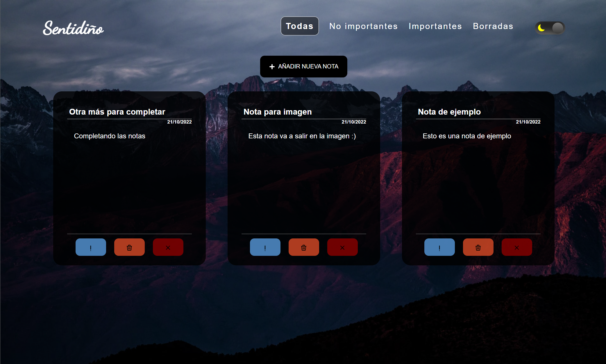
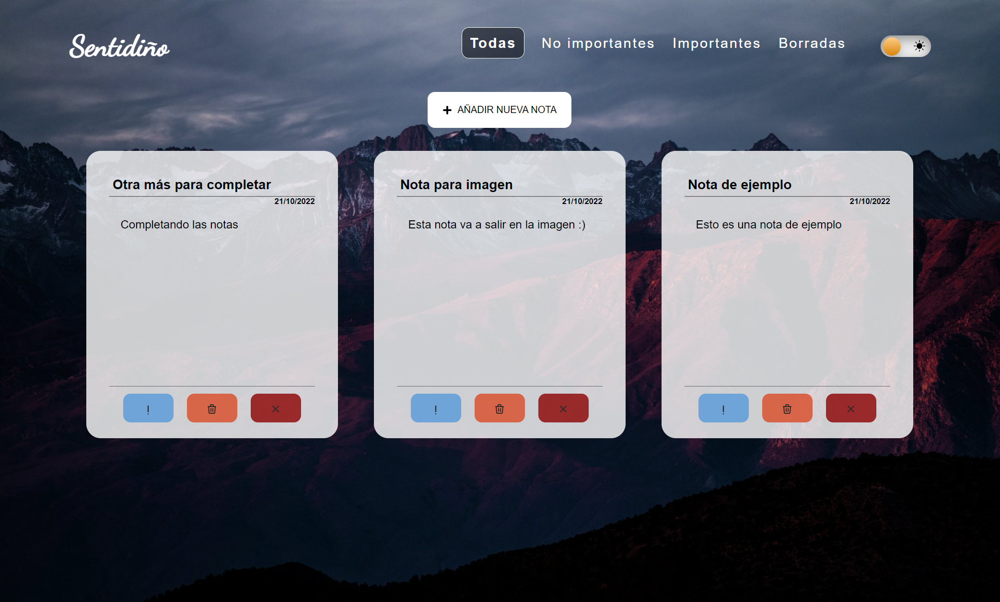
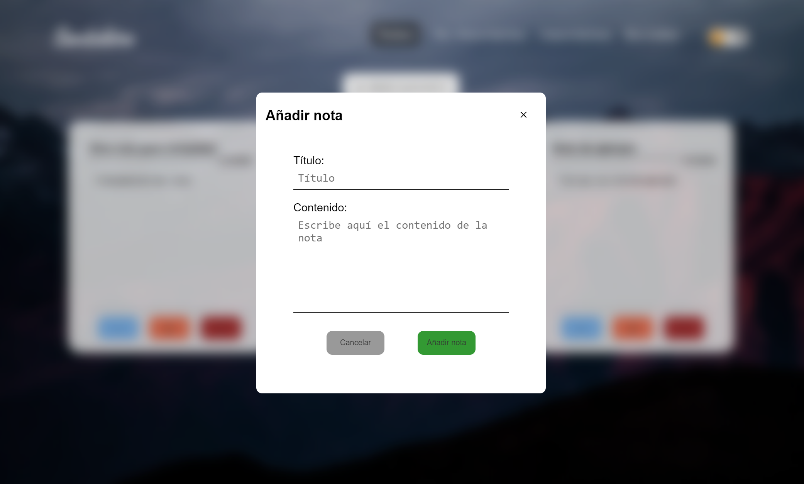
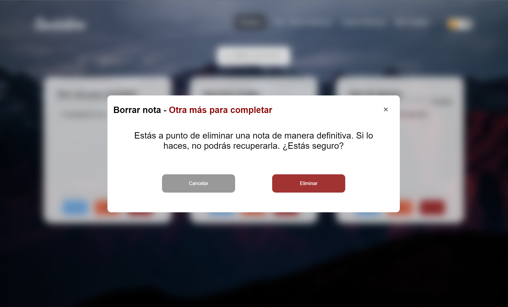
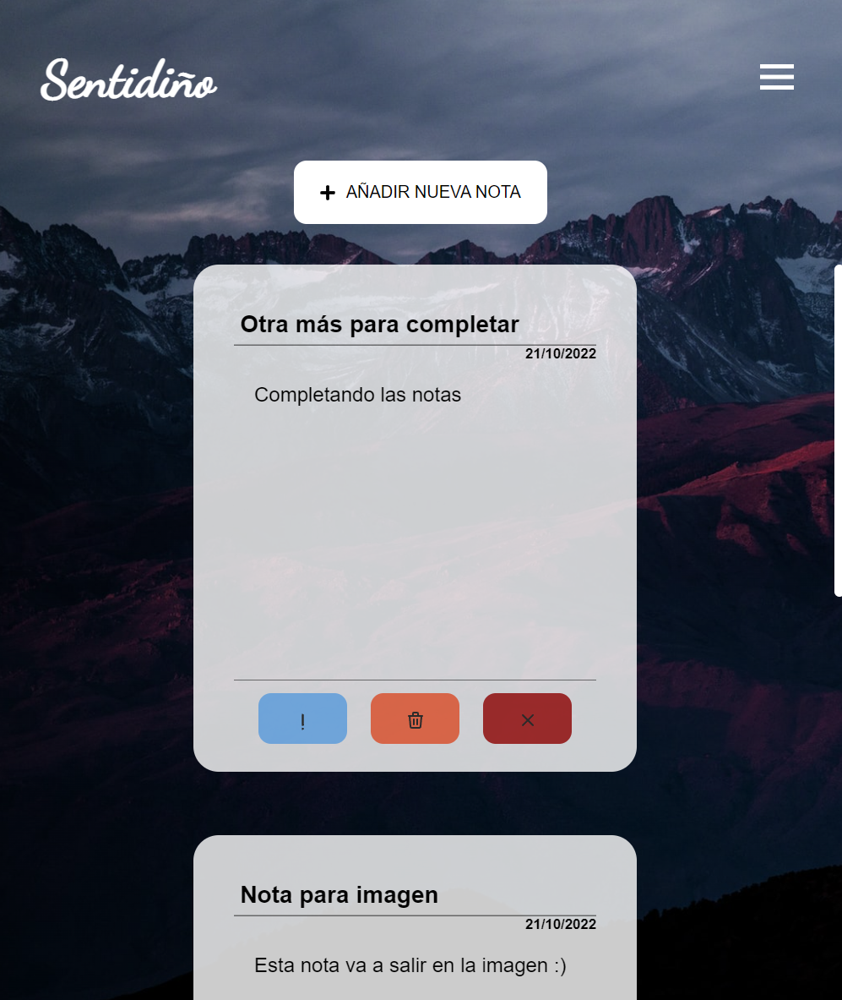
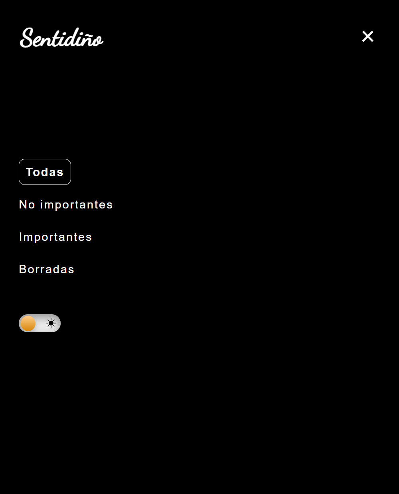

# Sentidiño

Aplicación de notas con posibilidad de crear una nota, marcar una nota como eliminada, marcar una nota como importante o eliminar una nota de manera definitiva.

La aplicación se trata de un **SPA** con una sección para cada estado de la nota (Importantes, No importantes y Eliminadas) y una sección para ver todas las notas disponibles. Cuenta adicionalmente con **modo oscuro** o **modo claro** a elección del usuario con persistencia de dicha opción.

Organizada como un **monorepo**, cuenta con una parte front-end desarrollada en **React** junto con **Redux** y una parte backend desarrollada con el uso de **NodeJS** y **Express**. Para servir el frontal, se aplica **SSG** (Static Site Generation) de modo que es el servidor el que sirve el cliente de manera estática, lo que tiene muchos beneficios de rendimiento. Para el almacenamiento de datos, se ha configurado un **SQLite** que se encontrará localmente en la máquina y se generará automáticamente.

## Imágenes






|          Vista móvil          |        Menú en vista móvil         |
| :---------------------------: | :--------------------------------: |
|  |  |

## Tecnologías

### Frontend

La aplicación ha sido creada con las siguientes tecnologías:

- **ReactJS**
- **Styled Components**
- **ViteJS**
- **TypeScript**
- **Redux Toolkit**
- **Redux Persist**
- **React Router**

### Backend

- **NodeJS**
- **Express**
- **SQLite3**
- **Winston**
- **Nodemon**

## Almacenamiento de datos

El almacenamiento de datos se lleva a cabo mediante SQLite3, donde el archivo se generará en la propia máquina donde corra el servidor de manera automática la primera vez que se emplee.

## Despliegue local

Para un despliegue local de la aplicación, simplemente clona el repositorio y en primer lugar instala los paquetes:

```bash
npm install
```

Seguidamente, levanta la aplicación con:

```bash
npm run start
```

Podrás acceder a la aplicación en tu navegador accediento a [http://localhost:5000](http://localhost:5000).

## Ramas

El repositorio cuenta con tres ramas:

- **dev**, rama de desarrollo.
- **qa**, rama de integración.
- **main**, rama de producción.

La única rama donde es posible subir cambios es la rama **dev**. Posteriormente se deberá de llevar a cabo una PR para llevar los cambios de una rama a otra.
